## 更新

### V1.2

1.  批量扫描模块，添加对存在漏洞的url导出功能
2.  修改检测漏洞后的显示，存在、不存在、异常

### V1.1

1.  参考冰蝎的代理，添加代理设置，方便走burp调试
2.  优化批量检查逻辑，使用接口，这样每次添加新的漏洞利用时，就不需要修改批量检查的逻辑。

## 0x01 这是个嘛？

这是一个构建图形化漏洞利用的一个项目，已经写好架子，只需要往里填充exp即可，帮助安全人员快速构建一个图形化的、跨平台的漏洞利用工具。

虽然有很多优秀的命令行利用工具，但我觉得还是带界面的方便。

使用本项目，你不需要懂太多Java语言，只需要了解基本的语法，参考自带的EXP例子，即可快速开发一款**属于你自己**的漏洞利用工具。

## 0x02 Demo

废话不多说，先上效果图，自带CVE-2020-14882 Weblogic远程代码执行漏洞

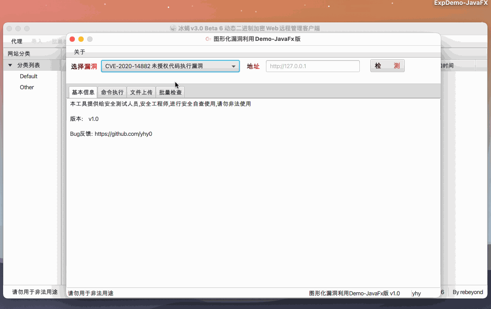

## 0x03 编写属于你的图像化漏洞利用工具

#### 3.1 项目结构

```apl
.
├── ExpDemo-JavaFX.iml
├── pom.xml	maven工程的基本文件
└── src	
    └── main
        ├── deploy
        │   └── ExpDemo-JavaFX-1.0.icns
        ├── java
        │   └── com
        │       └── yhy
        │           ├── Controller.java	 控制JavaFX图形化界面的各种显示、事件等，核心代码
        │           ├── Main.java     JavaFX 应用程序的入口
        │           ├── core    核心代码文件夹
        │           │   ├── CVE_2020_14882.java	 exp编写示例
        │           │   ├── Constants.java		  一些常量信息
        │           │   ├── ExploitInterface.java	 exp 编写要实现的接口
        │           │   ├── Job.java	批量检查的线程池
        │           │   └── VulInfo.java    映射批量检查界面中的表格，信息基本类
        │           └── tools		工具文件夹
        │               ├── HttpTool.java     HTTP 请求封装
        │               ├── MyCERT.java    HTTPS 请求证书设置
        │               └── Tools.java	    一些处理函数
        └── resources	资源文件夹
            ├── sample.fxml	 avaFX图形化界面描述文件
            ├── sec.png
            └── weixin.jpg
```


#### 3.2 编写EXP

编写EXP时，要使用 `implements`实现`ExploitInterface`接口，实现接口中的几个方法

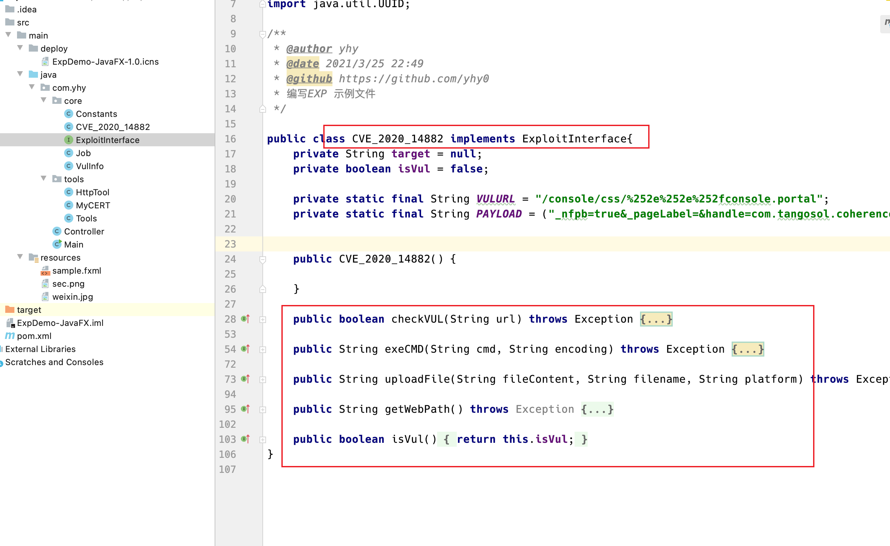

-   checkVUL		使用poc 检查是否漏洞
-   exeCMD          使用exp执行命令
-   uploadFile        使用命令执行 写webshell，上传文件
-   getWebPath     获取网站的web目录，供上传文件使用
-   isVul                是否存在漏洞，检查时会根据结构自动赋值，供后续调用

EXP具体编写请参考 `src/main/java/com/yhy/core/CVE_2020_14882.java` 示例

当编写完EXP后，转到 `src/main/java/com/yhy/core/Constants.java` 文件，修改`CVES` 变量，即图像化界面中可供选择的漏洞列表

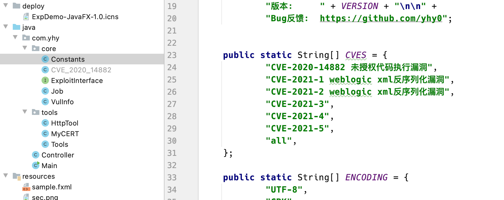

之后进入`src/main/java/com/yhy/core/Constants.java` 和 `com/yhy/tools/Tools.java` 文件编写逻辑

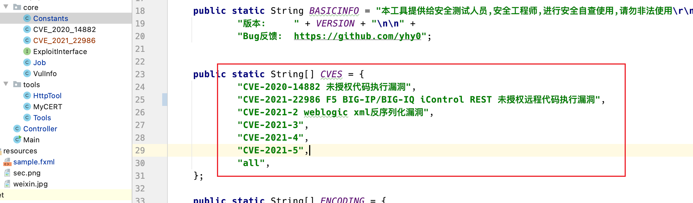

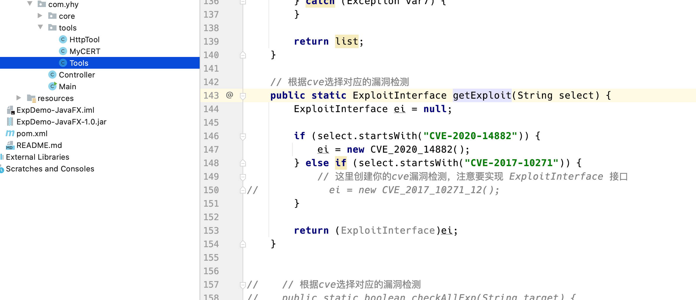

编写完后，可以直接执行`Main`类, 查看是否正常运行。

#### 3.3 部署，发布

当一切编写完成，bug修复完毕，在项目根目录下执行 `mvn jfx:jar` 即可生成 jar文件。

对方没有Java环境，不想安装怎么办？

使用`mvn jfx:native` 命令生产对应平台的文件，比如Mac 下，执行命令`mvn jfx:native` 命令就会在 **target/jfx/native** 目录下生成打包后应用，带可执行文件，带 JRE 运行环境。

 `mvn clean` 用于清除生成的文件。

 使用**target/jfx/app/ExpDemo-JavaFX-1.0-jfx.jar** 下的jar文件，**不要**使用 **target** 目录下的jar文件, **target** 目录下的jar文件命令执行不知道为啥没有回显

## 0x04 界面修改

对界面不满意，或者想添加其他功能

安装 JavaFx Scene Builder

https://www.oracle.com/java/technologies/javafxscenebuilder-1x-archive-downloads.html

安装完，在IDEA中右键打开(设置好JavaFx Scene Builder的路径)

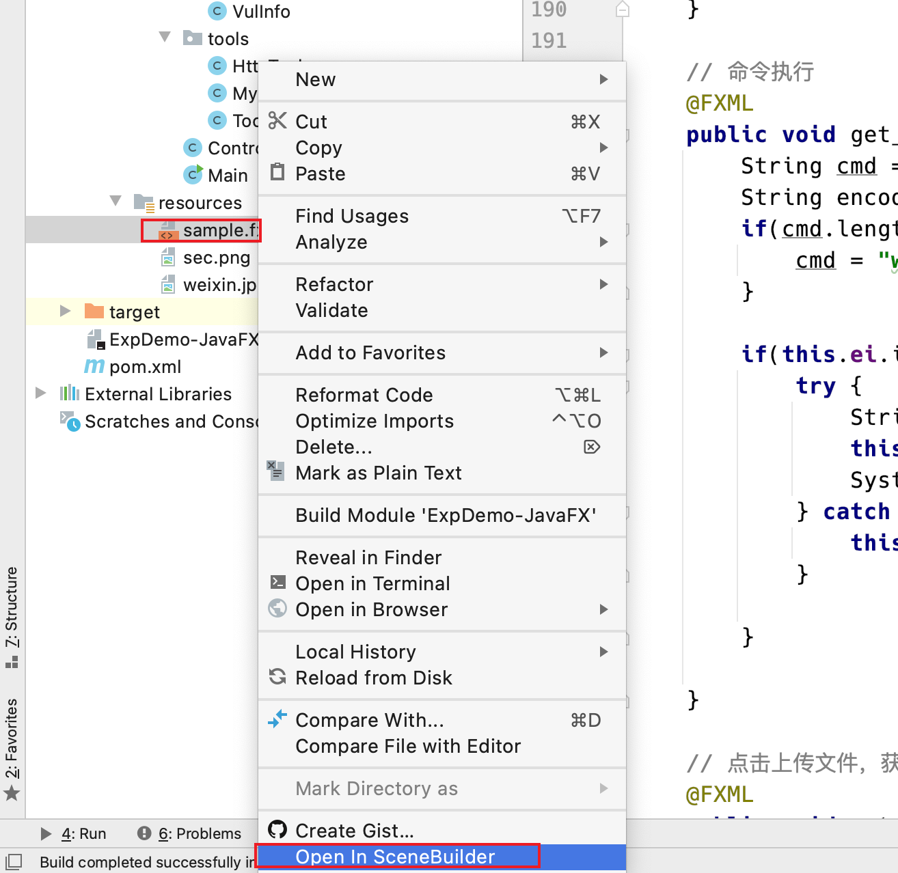

打开后

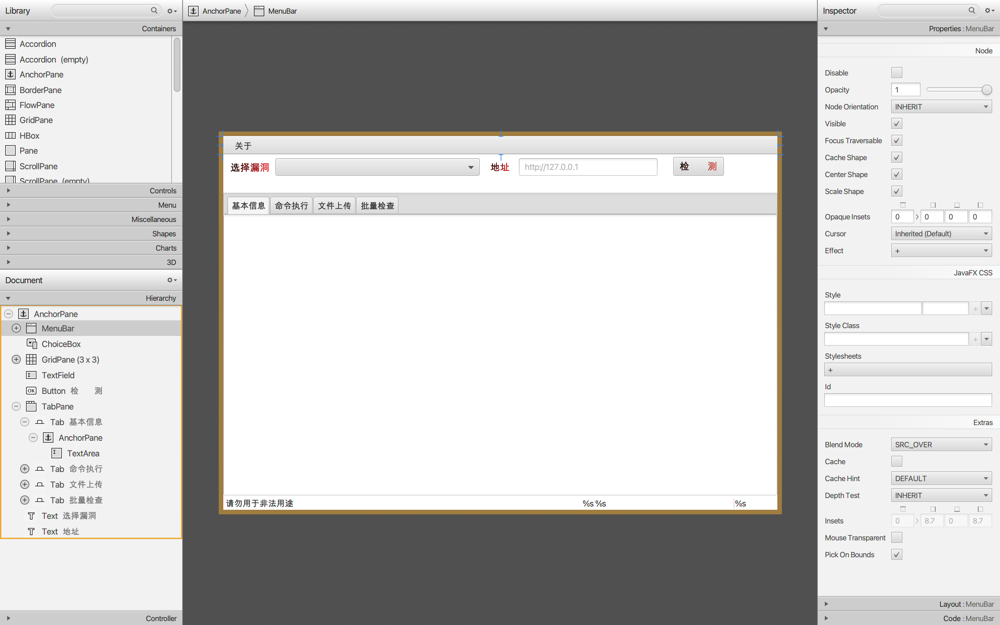

想添加什么控件，直接从Scene Builder的左边控件栏中拖拽一个到界面设计区域，然后只需要关心右侧栏第三个`Code`的`fx:id` 和` On Action ` 

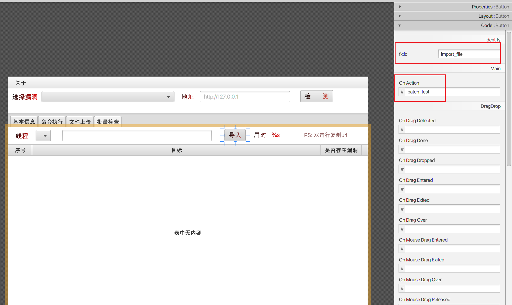

比如想添加一个 输入框，搜索框查询，然后拖一个 `TextField` 控件到设计区

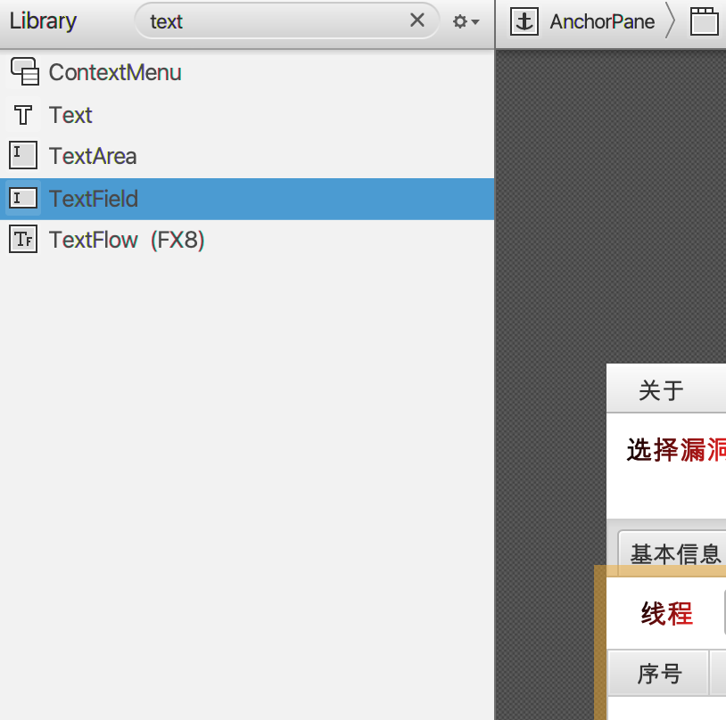

为这个 `TextField` 设置一个`fx:id` ，然后`Ctrl+s`保存,  `sample.fxml` 会做出相应的更改，不需要关心

之后到`src/main/java/com/yhy/Controller.java` 文件编写逻辑

1.  使用`@FXML`注解，声明变量

    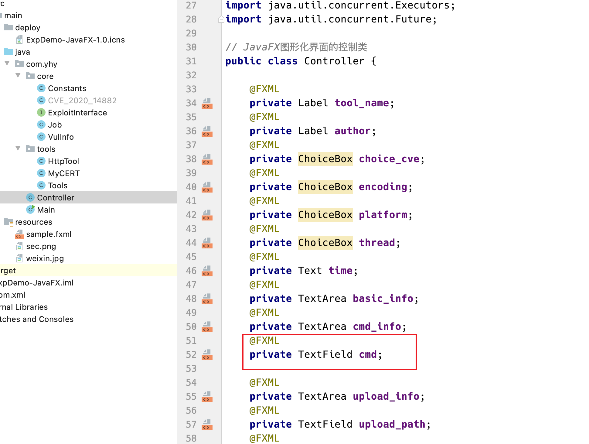

    

2.  在函数中使用变量

    使用`this.cmd.getText() `获取输入的值

    使用`this.cmd.setText() `设置值

    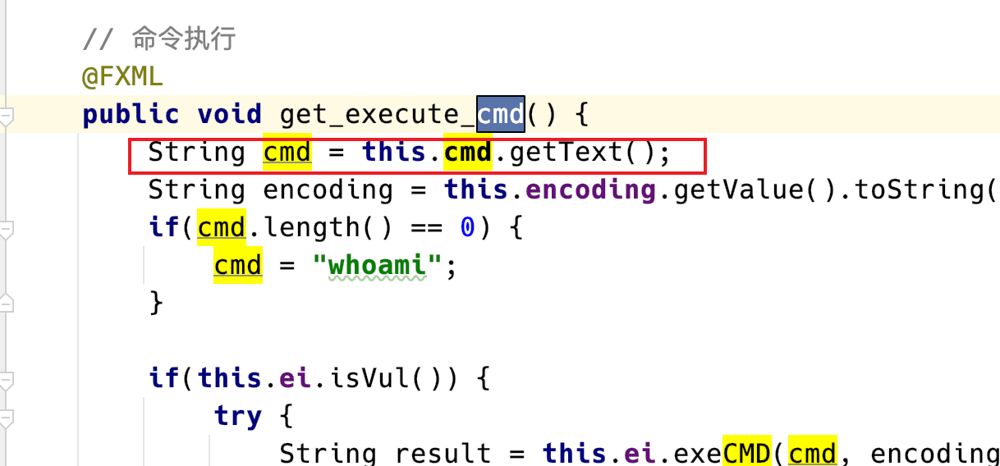

    其他控件使用，请参考`src/main/java/com/yhy/Controller.java` ，或者自行学习JavaFX。

## 0x05 免责声明

本工具仅能在取得足够合法授权的企业安全建设中使用，在使用本工具过程中，您应确保自己所有行为符合当地的法律法规。

如您在使用本工具的过程中存在任何非法行为，您将自行承担所有后果，本工具所有开发者和所有贡献者不承担任何法律及连带责任。

除非您已充分阅读、完全理解并接受本协议所有条款，否则，请您不要安装并使用本工具。

您的使用行为或者您以其他任何明示或者默示方式表示接受本协议的，即视为您已阅读并同意本协议的约束。


