## 0x00 更新

### V1.6

使用log4j输出日志到文件

### V1.5

界面修改，搞(抄)了个抽屉样式来切换不同的漏洞利用种类 ,打包方式更改 

请使用**mvn package assembly:single** 生成 jar文件，其他照旧，**mvn jfx:native**。

http://www.zhouruikang.cn/2020/0330/javafx03-drawer/

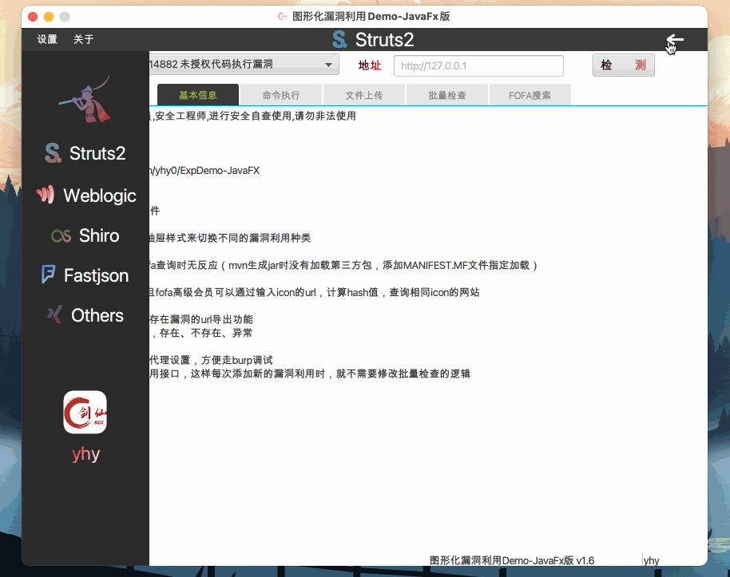

## 0x01 界面修改准备

因为用到了 Jfoenix，所以 **scene-builder**工具首先要加载**jfoenix-8.0.10.jar**包

>   Jfoenix: Java的UI控件不是很好看，而Jfoenix则是一位大佬开发的仿谷歌的MD设计的UI控件，是在JavaFx的UI控件基础上改造的，所以我们可以直接拿来用。

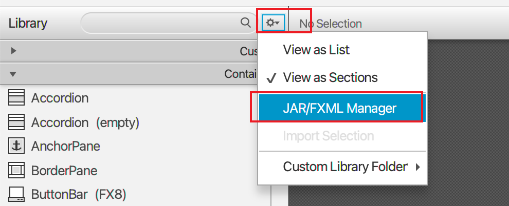

同时建议使用这个 https://gluonhq.com/products/scene-builder/ ，上次使用的加载jar包有点问题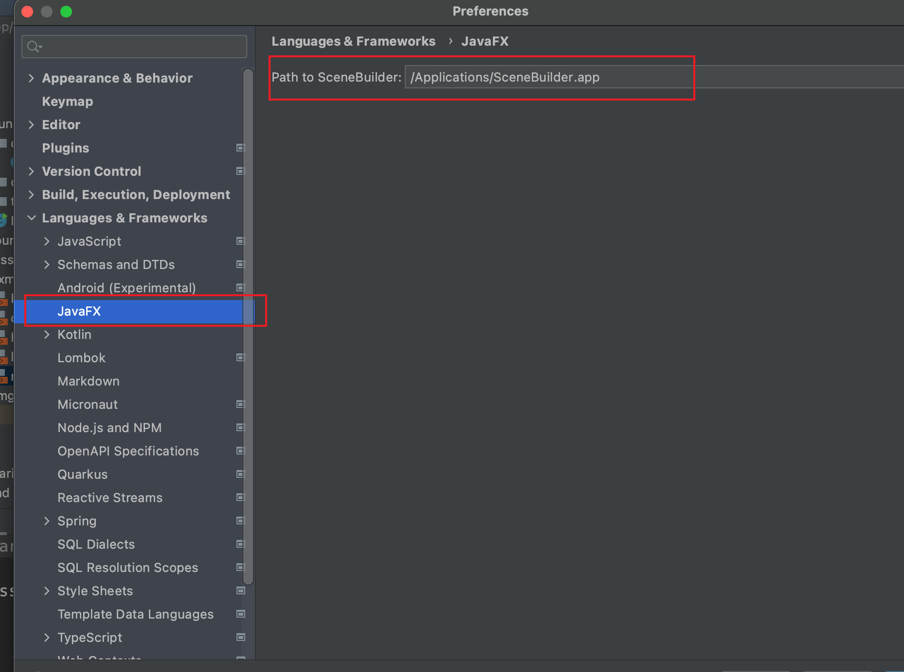

同时项目中使用到了FontAwesomeFX字体图标，所以也要把这个**fontawesomefx-8.9.jar**包支持加载进去

需要的jar包都可以在项目lib目录下找到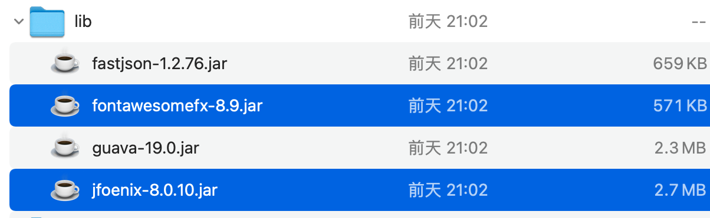


还有就是用到了**lambda**表达式去加载不同的**.fxml**文件来切换界面，所以Idea支持**lambda**表达式

File -- Project Structure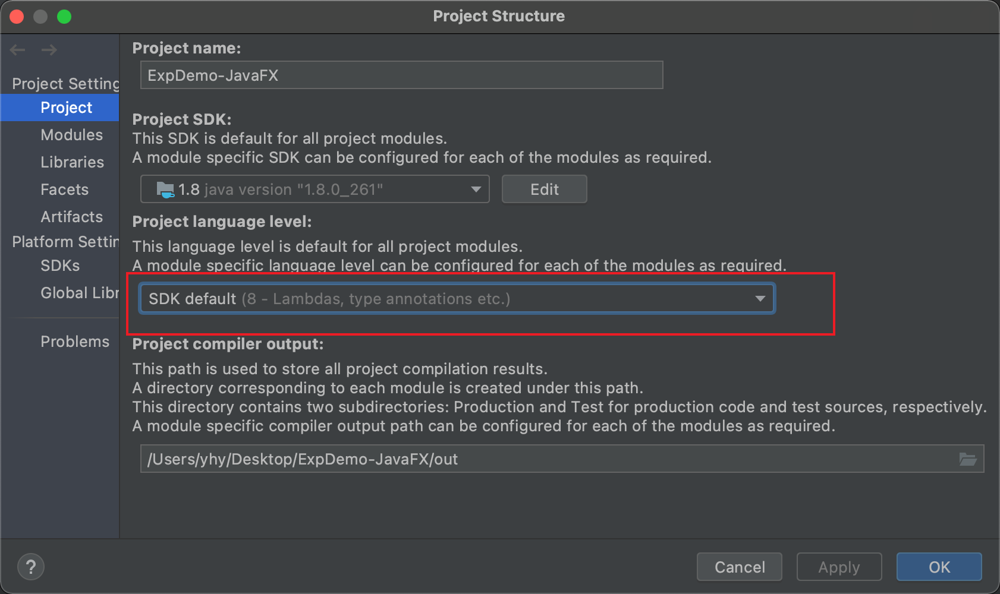

Preferences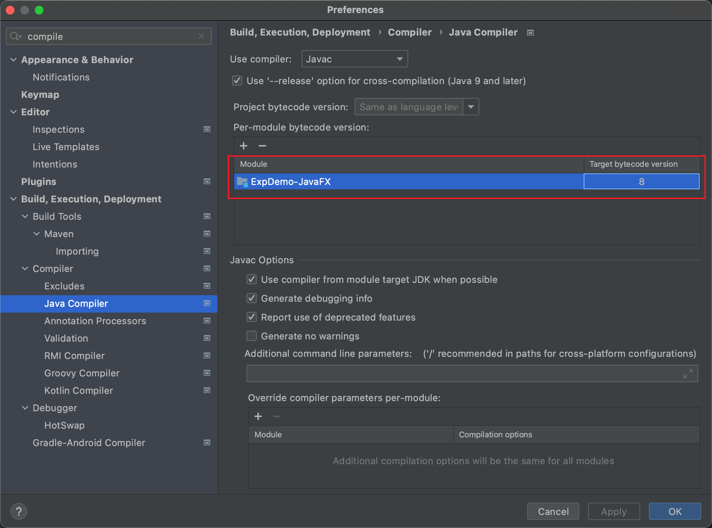

都需要修改一下为**8**或者**8**以上,一般默认都是8，如果报**lambda**相关错误，请自行检查是否为8及以上

## 0x02 自定义漏洞种类

项目目录结构发生了小改变

```apl
.
├── ExpDemo-JavaFX.iml
├── pom.xml	maven工程的基本文件
├── META-INF		指定在打包时，所需要的第三方依赖包，这样就不要到maven仓库中下载了，防止网络不好，打包失败
│   └── MANIFEST.MF
├── lib						第三方依赖包，所需要的第三方依赖包都放入这个文件夹，然后在MANIFEST.MF中指定路径
│   ├── fastjson-1.2.76.jar
│   ├── fontawesomefx-8.9.jar
│   ├── guava-19.0.jar
│   └── jfoenix-8.0.10.jar
└── src
    └── main
        ├── java
        │   └── fun
        │       └── fireline
        │           ├── Main.java   JavaFX 应用程序的入口
        │           ├── controller	控制JavaFX图形化界面的各种显示、事件等，核心代码  
        │           │   ├── MainController.java     主界面的controller，负责切换界面
        │           │   ├── OthersController.java   Others界面的相关逻辑
        │           │   └── Struts2Controller.java  Struts2漏洞利用界面的相关逻辑
        │           ├── core    核心代码文件夹
        │           │   ├── CVE_2020_14882.java	 exp编写示例
        │           │   ├── Constants.java		  一些常量信息
        │           │   ├── ExploitInterface.java	 exp 编写要实现的接口
        │           │   ├── Job.java	批量检查的线程池
        │           │   └── VulInfo.java    映射批量检查界面中的表格，信息基本类
        │           └── tools		工具文件夹
        │               ├── HttpTool.java     HTTP 请求封装
        │               ├── MyCERT.java    HTTPS 请求证书设置
        │               └── Tools.java	    一些处理函数
        └── resources			一些资源文件
            ├── css					修改 fxml 样式的css文件
            │   └── main.css
            ├── fxml				界面的设计文件
            │   ├── Fastjson.fxml
            │   ├── Main.fxml
            │   ├── Others.fxml
            │   ├── Shiro.fxml
            │   ├── Struts2.fxml
            │   ├── Weblogic.fxml
            │   └── drawer.fxml
            ├── img
            │   ├── sec.png
            │   └── weixin.jpg
            └── log4j.properties			日志相关设置
```

接下来就是自定义漏洞种类了，很简单，

1.  在**resources/fxml**目录下新建fxml文件，然后利用 **scene-builder**去设计界面，或者直接复制**Others.fxml**，在其基础上修改就行，具体怎么设计在[图形化漏洞利用Demo-JavaFX版](https://mp.weixin.qq.com/s/_CN0g-q3rvPgbTWGvAvqhA)有说，或者自行学习
2.  在**fun/fireline/controller**文件加下新建 **XxxController.java**，然后将上一步的**.fxml**文件中的**fx:controller**的值修改为**XxxController**，界面的具体逻辑就在这个Controller中编写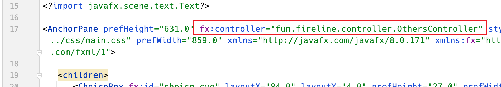

3.  显示到界面。在**fxml/drawer.fxml**中添加一个JFXButton, 设置一个**accessibleText**值,这个名字和新建的**.fxml**名一致，**text**是按钮的名字，其他是颜色、字体显示，可以利用**scene-builder**修改

    ```xml
            <JFXButton accessibleText="yhy" layoutX="1.0" layoutY="132.0" prefHeight="44.0" prefWidth="160.0" styleClass="menu" text="yhy">
               <font>
                  <Font size="23.0" />
               </font>
               <textFill>
                  <LinearGradient endX="1.0" endY="1.0">
                     <stops>
                        <Stop color="#e40000" />
                        <Stop color="WHITE" offset="1.0" />
                     </stops>
                  </LinearGradient>
               </textFill>
            </JFXButton>
    ```

    然后在**fun/fireline/controller/MainController.java**中426行的**refreshPage**函数中添加一个**case** 名字和**accessibleText**一致（区分大小写，.fxml文件名也是一样的）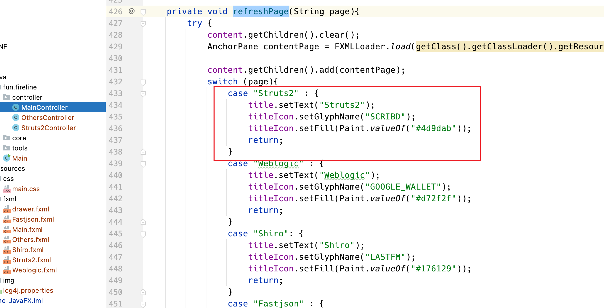

    

    **case**中

    ```java
    title.setText("Struts2");							  # 设置标题名
    titleIcon.setGlyphName("SCRIBD");		  # 标题名前面的图标
    titleIcon.setFill(Paint.valueOf("#4d9dab"));			# 图标颜色
    ```

图标样式名通过这个获取


>FontAwesomeFX的作者写了一个图标浏览桌面应用，下载链接 https://github.com/Jerady/fontawesomefx-glyphsbrowser/files/1441864/SearchBar.fontawesomefx-glyphsbrowser-1.3.0.zip)，解压后打开 `bin` 目录，按Mac或Windows双击不同程序。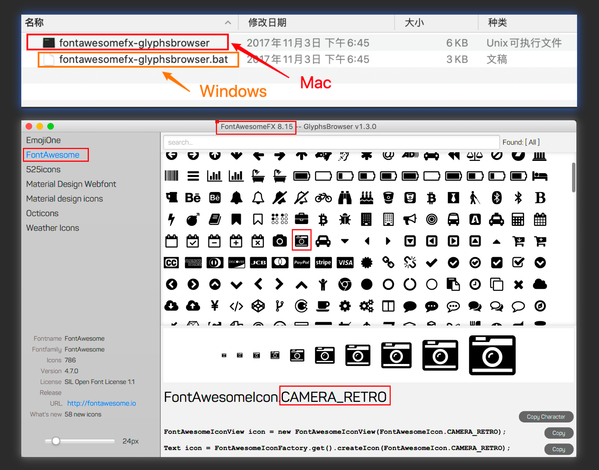

若想修改默认显示界面，将**refreshPage("Others")**修改为对应的fxml文件名。**fun/fireline/controller/MainController.java**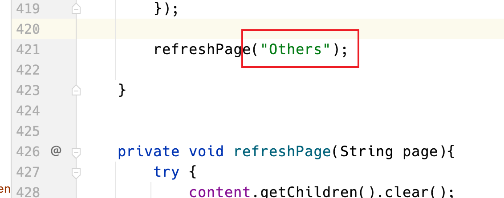

## 0x03 存在的问题

目前版本还有个问题，就是下方这一个红色方框圈住的，隐藏后，如果在这一块区域中存在按钮，或者其他需要点击的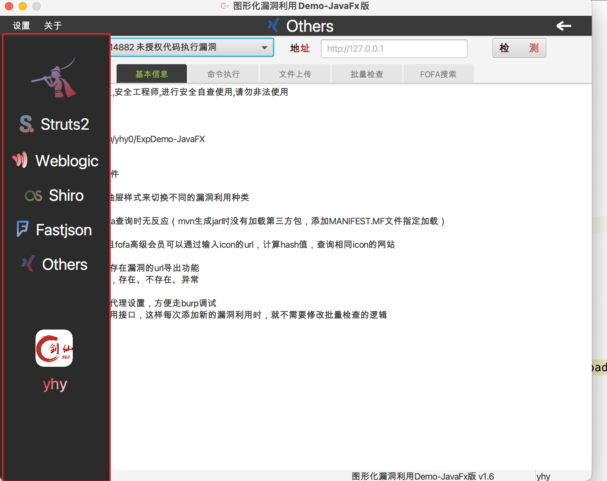

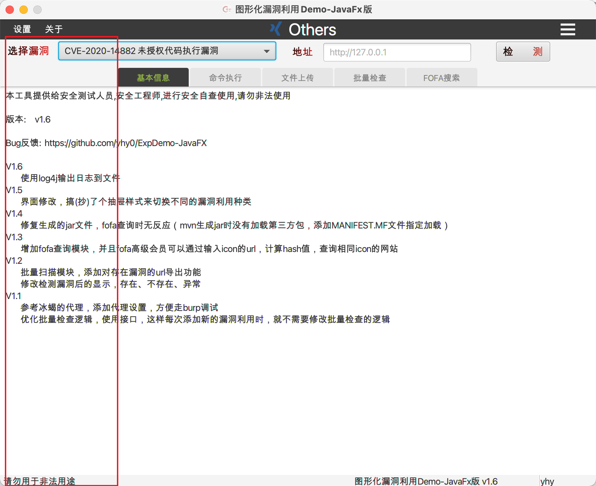

这一块就不能点击了，东西还是能看到的，就是不能点击，反复修改，还是没成功。

本来 **基本信息** 是挨着左侧栏的，当切换一次界面后，就不能点击了，试了各种办法，没解决。最后实在没办法，只能利用**css**样式将这一块调整到了中间。

但基本不影响使用，就是开发新界面时需要注意一下，不要让这一块出现交互的地方，非要不可的话就将 交互的区域 拉长，长度超过红框的范围

还有就是看着不太协调，毕竟本人太菜了，都是东拼西凑的，复制粘贴工程师，将就着用吧

配色问题就自己调吧,批量检查，因为是个耗时任务，太多的话，会陷入假死状态，缺少个等待动画

这只是个图形Demo，并**没有填充Exp**，请自行根据exp编写示例，自己填写。

我后续会根据其他师傅写的利用工具，copy一份他们的poc，慢慢填进去，就是不知道是什么时候了😋

## 0x04 免责声明

本工具仅能在取得足够合法授权的企业安全建设中使用，在使用本工具过程中，您应确保自己所有行为符合当地的法律法规。

如您在使用本工具的过程中存在任何非法行为，您将自行承担所有后果，本工具所有开发者和所有贡献者不承担任何法律及连带责任。

除非您已充分阅读、完全理解并接受本协议所有条款，否则，请您不要安装并使用本工具。

您的使用行为或者您以其他任何明示或者默示方式表示接受本协议的，即视为您已阅读并同意本协议的约束。


